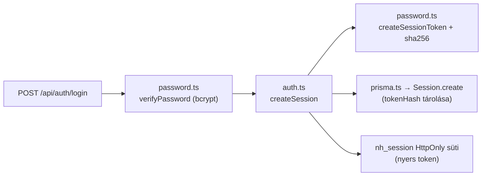
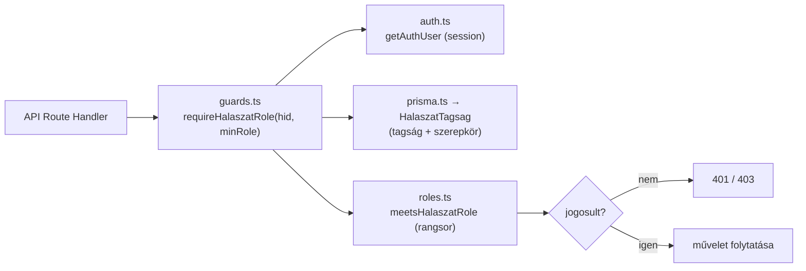
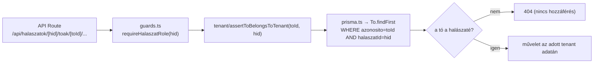
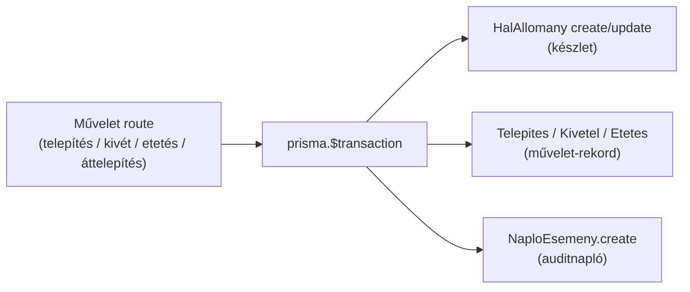

# Component Diagram

Ez a dokumentum a Németh Horgászat rendszer belső komponens-szintű (C4 3. szint)
felépítését írja le, a tényleges kódbázis alapján (`src/app/**`, `src/lib/**`,
`prisma/`). A diagram a rétegeket és a köztük lévő **függőségi irányokat**
mutatja; alatta a négy kulcsfolyamat (authentikáció, authorizáció,
tenant-izoláció, auditnaplózás) külön ábrával és magyarázattal szerepel.

## Komponens-diagram (rétegek és függőségek)

```mermaid
flowchart TD
    subgraph FE["Frontend Layer"]
        Pages["App Router Pages<br/>(src/app/**/page.tsx)"]
        RComp["React Components<br/>(AppShell, *Client, modals)"]
        UIComp["UI Components<br/>(GlassCard, GlassModal)"]
    end

    subgraph BE["Backend Layer"]
        API["API Route Handlers<br/>(src/app/api/**/route.ts)"]
    end

    subgraph APP["Application Layer"]
        Guards["guards.ts<br/>(requireUser / requireHalaszatRole / requireToAccess)"]
        Roles["roles.ts<br/>(rank + meets*Role + canManageTarget)"]
        Auth["auth.ts<br/>(createSession / deleteSession / getAuthUser)"]
        Tenant["tenant/*<br/>(assertToBelongsToTenant)"]
        Password["password.ts<br/>(hash / verify / sha256 / token)"]
    end

    subgraph INFRA["Infrastructure Layer"]
        PrismaClient["prisma.ts<br/>(singleton PrismaClient)"]
        ORM["Prisma ORM"]
        DB["MySQL"]
    end

    %% Frontend belső függőségek
    Pages --> RComp
    RComp --> UIComp

    %% Frontend -> Backend (HTTP fetch)
    RComp -- "fetch /api/**" --> API
    Pages -- "fetch /api/**" --> API

    %% Backend -> Application
    API --> Guards
    API --> Tenant
    API --> Password

    %% Application belső függőségek
    Guards --> Auth
    Guards --> Roles
    Auth --> Password

    %% Application -> Infrastructure
    Guards --> PrismaClient
    Auth --> PrismaClient
    Tenant --> PrismaClient
    API --> PrismaClient

    %% Infrastructure lánc
    PrismaClient --> ORM
    ORM --> DB
```

**A függőségi irány felülről lefelé mutat:** a Frontend a Backend API-t hívja
(HTTP `fetch`), a route handlerek az Application réteg segédmoduljaira
támaszkodnak, azok pedig az Infrastructure rétegen (`prisma.ts` → Prisma ORM →
MySQL) keresztül érik el az adatot. A `roles.ts` és a `password.ts` **tiszta**
modulok (nincs DB/Next függőségük), ezért külön unit-tesztelhetők.

## 1. Authentikációs folyamat (authentication)

A bejelentkezés a jelszót bcrypttel ellenőrzi (`verifyPassword`), majd
`createSession` egy 256 bites random tokent állít elő; a **nyers** token a
HttpOnly `nh_session` sütibe kerül, az adatbázisba viszont csak a token
**SHA-256 hash**-e (`Session.tokenHash`). A későbbi kéréseknél a `getAuthUser`
a sütiből kiolvasott tokent hash-eli, és a `Session` táblából (lejárat-szűréssel)
oldja fel a felhasználót.

## 2. Authorizációs folyamat (authorization)

A védett végpontok a `guards.ts` helpereit hívják. A `requireHalaszatRole`
előbb azonosítja a felhasználót (`getAuthUser`), lekéri a `HalaszatTagsag`
szerepkörét, majd a `roles.ts` rangsor-logikájával (`STAFF < ADMIN < OWNER`)
dönt: ha a szerepkör nem éri el a `minRole` szintet, `401`/`403` a válasz.

## 3. Tenant-izolációs folyamat (tenant isolation)

A tenant-szeparációt két réteg biztosítja: a `requireHalaszatRole` ellenőrzi,
hogy a hívó tagja-e a `[hid]` halászatnak, az `assertToBelongsToTenant` pedig
hogy a `[toId]` tó **valóban** ehhez a halászathoz tartozik (`findFirst` a
`halaszatId`-re szűrve). Idegen tenant tava `404`-et kap, így egy halászat tagja
nem érheti el más halászat adatát.

## 4. Auditnaplózási folyamat (audit logging)

A készletmódosító műveletek **egyetlen tranzakcióban** (`prisma.$transaction`)
frissítik a `HalAllomany`-t, rögzítik a művelet-rekordot, és írnak egy
`NaploEsemeny` auditbejegyzést (ember által olvasható `leiras`-szal).
Áttelepítésnél két naplóesemény keletkezik (forrás kivét + cél telepítés). A
napló a `timeline`/`summary` végpontokon olvasható vissza.

> Megjegyzés (ismert hiányok): a `NaploEsemeny` jelenleg nem rögzíti a cselekvő
> `felhasznaloId`-t (letagadhatóság — lásd `05_security_ops/threat-model.md`
> STRIDE-R), és a `hibabejelentesek` végpontok kívül esnek a fenti
> guard-láncon (auth-hiány). Ezek a release előtt rendezendők.

## Komponens-felelősségek (összefoglaló)

| Réteg | Komponens | Felelősség |
|---|---|---|
| Frontend | App Router Pages | Útvonalak, szerveroldali oldalváz, adatlekérés indítása. |
| Frontend | React Components | Interaktív kliens-logika (listák, dashboard, modálok). |
| Frontend | UI Components | Újrafelhasználható megjelenítés (kártya, modál). |
| Backend | API Route Handlers | HTTP belépési pont, bemenet-validáció, válaszformálás. |
| Application | `guards.ts` | Authentikáció + authorizáció belépési pontja. |
| Application | `roles.ts` | Tiszta rangsor/jogosultsági logika (tesztelhető). |
| Application | `auth.ts` | Session életciklus (létrehozás/törlés/feloldás), süti. |
| Application | `tenant/*` | Tenant-hovatartozás ellenőrzése (`assertToBelongsToTenant`). |
| Application | `password.ts` | Jelszó-hash/verify, token + SHA-256 (tiszta). |
| Infrastructure | `prisma.ts` | Singleton Prisma kliens (dev hot-reload guard). |
| Infrastructure | Prisma ORM / MySQL | Adatelérés és perzisztencia. |
